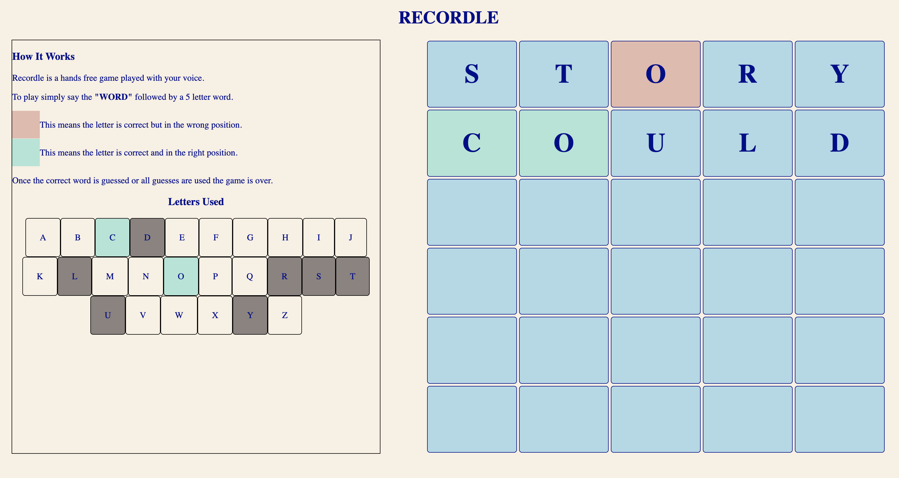

<div id="top"></div>

<details>
  <summary>Table of Contents</summary>
  <ol>
    <li>
      <a href="#about-the-project">About The Project</a>
      <ul>
        <li><a href="#built-with">Built With</a></li>
      </ul>
    </li>
    <li>
      <a href="#getting-started">Getting Started</a>
      <ul>
        <li><a href="#prerequisites">Prerequisites</a></li>
        <li><a href="#installation">Installation</a></li>
      </ul>
    </li>
    <li><a href="#usage">Usage</a></li>
    <li><a href="#license">License</a></li>
    <li><a href="#contact">Contact</a></li>
    <li><a href="#acknowledgments">Acknowledgments</a></li>
  </ol>
</details>


<!-- ABOUT THE PROJECT -->
## About The Project


<p align="right">(<a href="#top">back to top</a>)</p>


### Built With

* HTML, CSS, and JavaScript
* Express.js server deployed through Heroku

<p align="right">(<a href="#top">back to top</a>)</p>


<!-- GETTING STARTED -->
## Getting Started

Project is deployed [Here](https://radiant-badlands-77933.herokuapp.com/)

This app is built in HTML, CSS, and JavaScript. The app is using an express server and deployed through Heroku. Deepgram API is used for the speech transcription.

### Installation

1. Get a free API Key at [https://deeogram.com](https://console.deepgram.com/signup)
2. Clone the repo
   ```sh
   git clone https://github.com/Jaydon-Goodrich/recordle-hackathon.git
   ```
3. Install NPM packages
   ```sh
   npm install
   ```
4. Enter your API in `.env`
   ```js
	DG_API_KEY='DEEPGRAM_API_KEY HERE'
	PROJECT_ID='DEEPGRAM_PROJECT_ID';
   ```

<p align="right">(<a href="#top">back to top</a>)</p>


<!-- USAGE EXAMPLES -->
## Usage

This game is played with your voice. Start the game by pressing the button and then start playing. Say "word" followed by a 5 letter word to make your guess. Find the word of the day within six guess and you win.

<p align="right">(<a href="#top">back to top</a>)</p>

<!-- LICENSE -->
## License
Copyright 2022 Jaydon Goodrich

Distributed under the Apache 2.0 License. See `LICENSE` for more information.

<p align="right">(<a href="#top">back to top</a>)</p>

<!-- CONTACT -->
## Contact

Jaydon Goodrich - jaydongoodrich@gmail.com

Project Link: [https://github.com/Jaydon-Goodrich/recordle-hackathon](https://github.com/Jaydon-Goodrich/recordle-hackathon)

<p align="right">(<a href="#top">back to top</a>)</p>

<!-- ACKNOWLEDGMENTS -->
## Acknowledgments

* [https://deepgram.com/](https://deepgram.com/)
